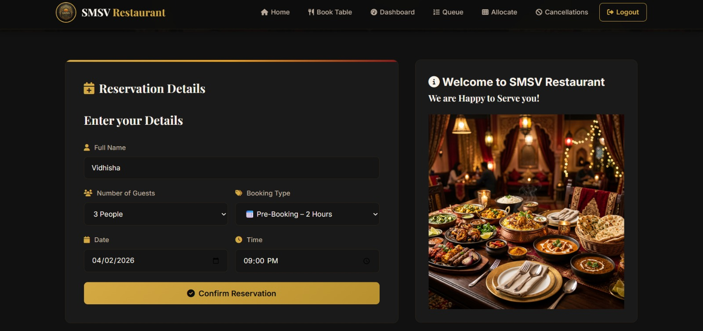
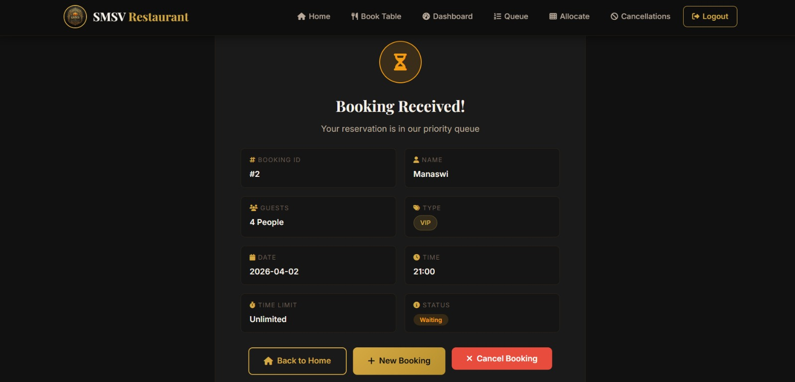
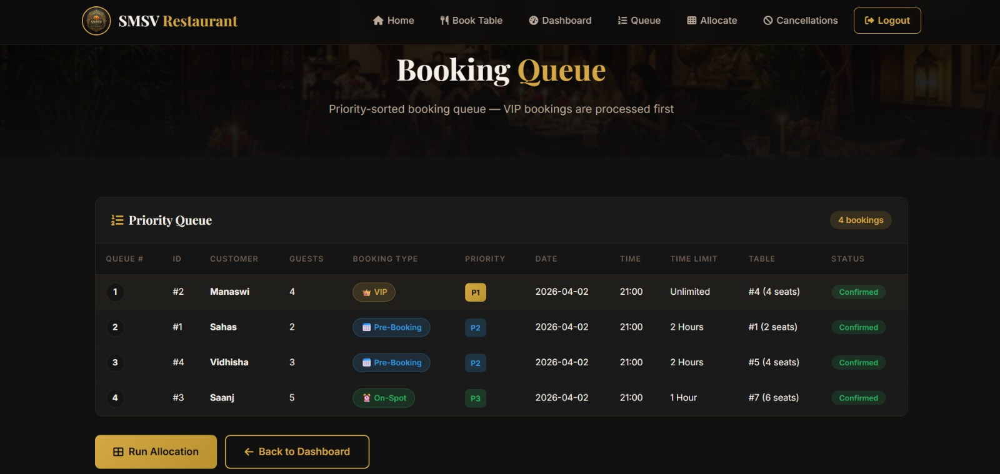

# 🍽️ Reservation & Scheduling Management System for SMSV Restaurant

A web-based restaurant reservation system that allows users to book tables online and helps restaurant staff efficiently manage reservations and schedules.

🔗 Live Website: https://smsv-restaurant-3.onrender.com/

---

## 📌 Project Overview

The Reservation & Scheduling Management System is designed to simplify restaurant table booking and scheduling. Traditional methods like phone calls or manual registers often lead to errors, double bookings, and poor customer experience.

This system provides a digital solution where users can check availability and reserve tables easily through a website, while admins can manage bookings efficiently.

Online reservation systems improve efficiency, reduce manual effort, and enhance customer satisfaction by providing real-time booking capabilities. :contentReference[oaicite:0]{index=0}

---

## 🚀 Features

### 👤 User Side  
- Select date and time  
- Book table online  
- Instant booking confirmation  

### 🔐 Admin Side
- Manage reservations  
- View booking details  
- Avoid overlapping bookings  
- Efficient table scheduling  

---

## 🛠️ Tech Stack

- **Frontend:** HTML, CSS, JavaScript  
- **Backend:** Flask (Python)  
- **Database:** SQLite  
- **Deployment:** Render  

---

## 📊 System Workflow

1. User visits website  
2. Selects preferred time slot  
3. Enters booking details  
4. Reservation stored in database  
5. Confirmation displayed  

---

### Installation

```bash
# 1. Clone the repository
git clone https://github.com/YOUR_USERNAME/SMSV-Restaurant.git
cd SMSV-Restaurant

# 2. Install dependencies
pip install -r requirements.txt

# 3. Run the application
python app.py

# 4. Open in browser
# http://127.0.0.1:5000
```
---

## 📁 Project Structure

```
SMSV-Restaurant/
├── app.py              # Flask application (routes)
├── database.py         # SQLite setup & initialization
├── models.py           # Data operations & CRUD
├── services.py         # Algorithms (Greedy + Backtracking)
├── requirements.txt    # Python dependencies
├── README.md           # Project documentation
├── .gitignore          # Git ignore rules
├── templates/
│   ├── base.html           # Base layout template
│   ├── index.html          # Homepage
│   ├── book.html           # Booking form
│   ├── confirmation.html   # Booking confirmation
│   ├── admin_login.html    # Admin login
│   ├── dashboard.html      # Admin dashboard
│   ├── queue.html          # Priority queue view
│   ├── allocation.html     # Greedy allocation page
│   └── cancellation.html   # Backtracking cancellation
└── static/
    ├── css/style.css       # Premium Indian theme CSS
    └── images/             # Logo, hero, gallery images
```
---

## 📷 Screenshots
### Customer Registration Page (CRP)


### Booking Received Page (BRP)


### Booking Queue (BQ)


### Table Allocation Results ()


---

## 📄 Pages

| Page | URL | Description |
|---|---|---|
| Home | `/` | Hero banner, menu, gallery, contact |
| Book Table | `/book` | Booking form with type selection |
| Confirmation | `/confirmation/<id>` | Booking details & cancel option |
| Admin Login | `/admin/login` | Secure admin authentication |
| Dashboard | `/admin/dashboard` | Stats, bookings, table management |
| Queue | `/admin/queue` | Priority-sorted booking queue |
| Allocation | `/admin/allocate` | Run greedy algorithm |
| Cancellation | `/admin/cancellation` | Cancel & backtrack replacement |

---

## ⚙️ Installation & Setup

```bash
# Clone the repository
git clone https://github.com/your-username/your-repo-name.git

# Navigate to project folder
cd your-repo-name

# Install dependencies
pip install -r requirements.txt

# Run the app
python app.py
